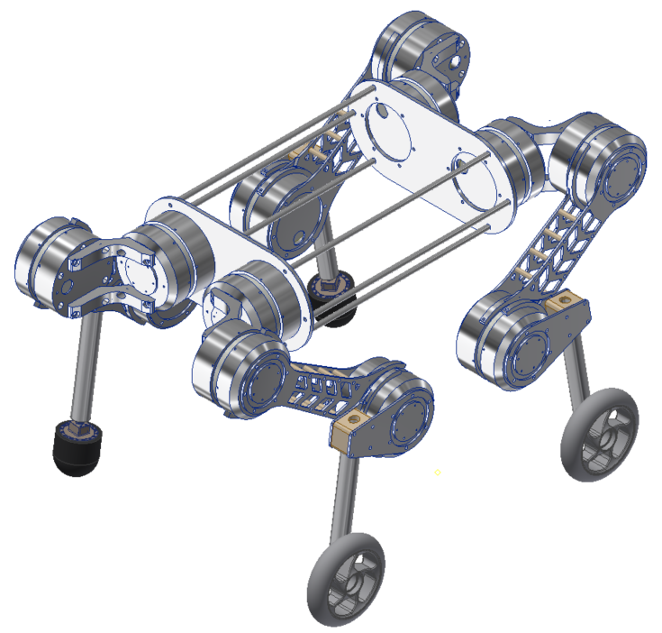

# Quadruped-AllTerrain-Robot

## Introduction

This repository contains information about the design and development of a quadruped robot. It includes details about the advantages of legged robots over wheeled robots, commercial and popular products in the field, mechanical design, and more.

## Advantages of Robots with Legs / Legs over Wheeled Robots

- Greater ability to overcome obstacles - agility
- Increased pulling force

## Commercial and Popular Products

### Anymal C - ETHZ / Anybotics
